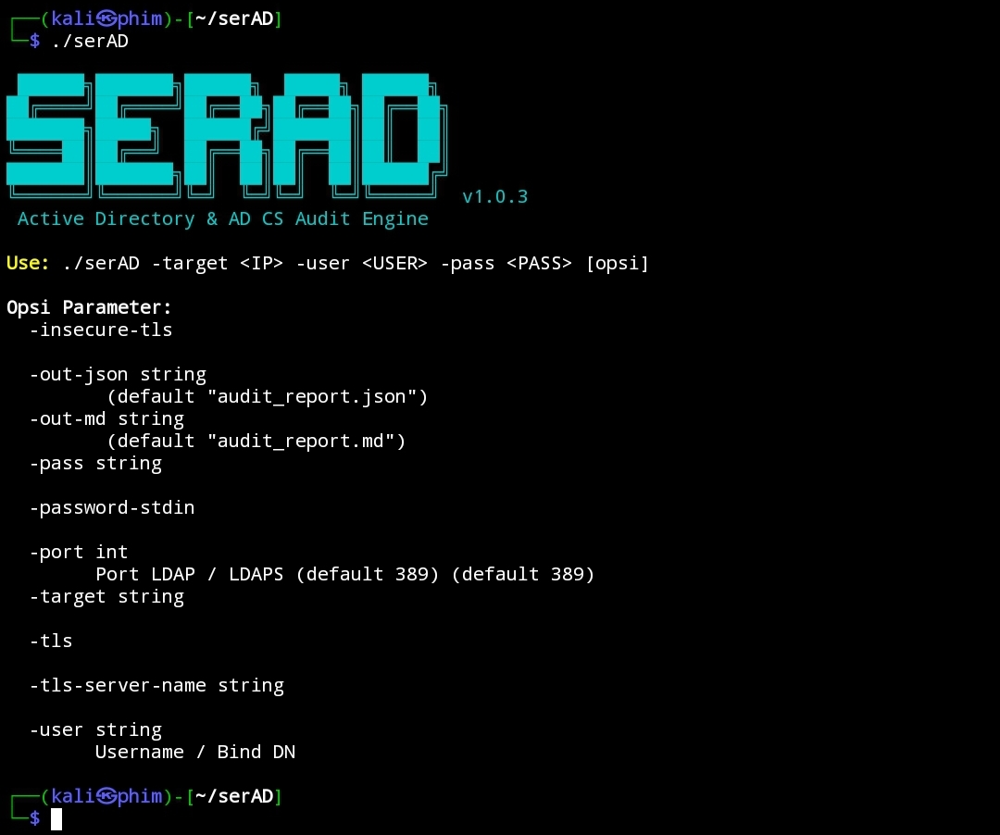

# serAD

**serAD** (*Active Directory Audit Engine*) is a high-performance Active Directory (AD) and Active Directory Certificate Services (AD CS) audit tool written in Go. Designed for Blue Teams, Auditors, and Security Engineers, **serAD** focuses on passive (read-only) security assessments that are safe, fast, and contained, eliminating out-of-scope risks.

## Features & Project Structure

- Safety Gatekeeper (pkg/gatekeeper): Validates target IPs against RFC1918 boundaries, local subnets, and enforces TTL=1 restrictions before connecting.
- Zero-Dependency & Fast: Compiles into a single static binary running natively on Linux, macOS, Windows, and Termux/ARM without Python or .NET runtimes.
- Passive AD & AD CS Detection: Identifies ESC1, ESC3, ESC6, ESC8, Kerberoasting, AS-REP Roasting, and Delegation risks (Unconstrained, Constrained, RBCD).
- Interface-Driven Reporter (pkg/reporter): Supports Terminal (color-coded), Markdown (detailed audit reports), and JSON (SIEM integration).

## Installation, Usage & Security Disclaimer

To build from source, run:
git clone https://github.com/seraphimdeck/serAD.git && cd serAD && go build -o serAD cmd/serAD/main.go

Or install directly via:
go install github.com/seraphimdeck/serAD/cmd/serAD@latest

To execute a standard audit scan:
./serAD -d domain.local -u auditor_user -p 'Password123!' -dc-ip 192.168.1.10

To export results directly to Markdown and JSON:
./serAD -d domain.local -u auditor_user -p 'Password123!' -dc-ip 192.168.1.10 -o report.md -json report.json

serAD is strictly a passive (read-only) audit tool performing LDAP queries and passive HTTP probes without modifying Active Directory objects or requesting certificates. Usage must comply with official permissions and applicable laws. Licensed under the MIT License.
